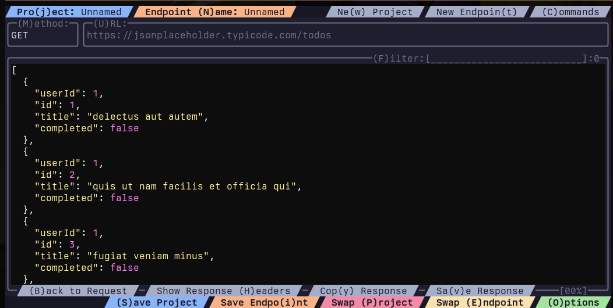

# tome

 
<em>Tome displaying a request from a configured endpoint</em>

Terminal User Interface for API endpoint configurations, testing, and code generation.

## Installation
Download the correct binary for your architecture from the Releases section.

## Features

### Projects
Tome can save groups of endpoints as projects. Project files are located in the application data folder for each OS. Saved endpoints are saved to their respective project files.

- Mac: ~/Library/Application Support/com.s9tpepper.Tome/projects/*.project
- Linux: ~/.config/tome/projects/*.project

### Themes
Tome has application themes and syntax highlighting themes. These settings are saved to an options file located in the same directories as projects.

- Mac: ~/Library/Application Support/com.s9tpepper.Tome/options/options.json
- Linux: ~/.config/tome/options/options.json

### Postman Import/Export
Tome can both export and import Postman collection files so you can share and use collections from Postman. From the dashboard press C to open the Commands box and choose either I or E to import or export from/to Postman.

### Code Generation
Tome will generate basic code for TS/JS/Rust, but this feature is currently in progress as it has not fully integrated project variables as part of the output. The templates for code generation can be edited and are located as described below.

- Mac: ~/Library/Application Support/com.s9tpepper.Tome/code_templates/*.txt
- Linux: ~/.config/tome/code_templates/*.txt

## Known Issues
- Request body text area sometimes loses cursor, left/right arrows bring it back.
- Code generation is not replacing project variables annotations with variables in the function arguments.
- Mouse support is coming up soon after first launch.
- Pretty print responses that have been minified.

## Upcoming Features
- [ ] OpenAPI import support
- [ ] NeoVim plugin
- [ ] Endpoint dependencies and response chaining to request bodies
- [ ] Automated project test runs
